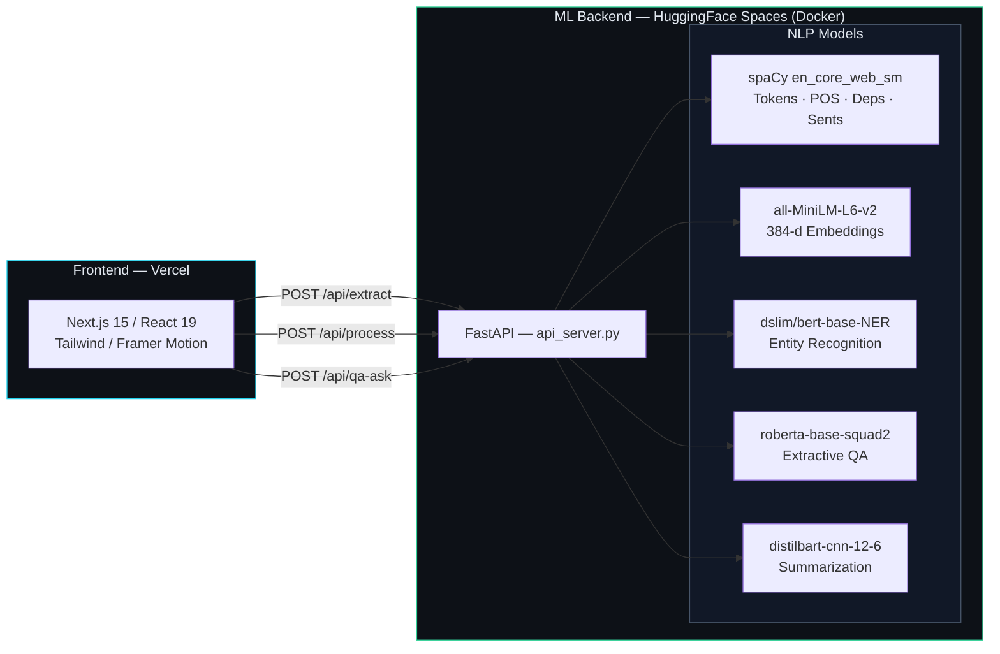

# CADIS — Context-Aware Document Intelligence System


A document intelligence platform that runs a six-module NLP pipeline over any PDF, DOCX or
pasted text — preprocessing, sentence embeddings, named entity recognition, ambiguity
resolution, extractive question answering and abstractive summarization — and walks you
through each stage in an interactive Next.js dashboard.

---

## Architecture



There is no separate API gateway — the frontend calls FastAPI directly, with CORS
restricted to the origins listed in `api_server.py`.

### Request Flow

1. **Upload** — the user drops a `.pdf` / `.docx` / `.txt` file (or pastes text, or picks
   a bundled sample) on `/launch`
2. **Extract** — `POST /api/extract` parses the file with `pypdf` / `python-docx` and
   returns plain text
3. **Process** — `POST /api/process` runs all six modules in one call and returns a single
   JSON payload
4. **Explore** — the result is cached in `localStorage` and rendered across six pages under
   `/pipeline/*`, one per module
5. **Ask** — on the QA page, `POST /api/qa-ask` answers arbitrary follow-up questions
   against the same document

---

## The Six Modules

| # | Module | Model | What it produces |
|---|--------|-------|------------------|
| 1 | **Preprocessing** | spaCy `en_core_web_sm` | Tokens with lemma/POS/dependency, sentence split, corpus stats |
| 2 | **Embeddings** | `all-MiniLM-L6-v2` | 384-d sentence vectors, cosine similarity matrix, most-similar pairs |
| 3 | **NER + IE** | `dslim/bert-base-NER` + spaCy | Person/Org/Location/Date/Money entities, subject-verb-object relations |
| 4 | **Ambiguity** | MiniLM + spaCy parse | PP-attachment and anaphoric ambiguities with a resolved candidate |
| 5 | **QA Engine** | `deepset/roberta-base-squad2` | Extractive answer spans with character offsets and confidence |
| 6 | **Summary** | `sshleifer/distilbart-cnn-12-6` | Abstractive executive summary, key sentences, date-anchored timeline |

### How QA works

Extractive QA returns a span of your document — it never generates text, so it cannot
hallucinate. Getting a *correct* span requires more than an argmax:

- The document is split into overlapping 200-word passages; MiniLM ranks them against the
  question and the top 6 go to the model. Long documents stay answerable without running
  the QA model over every window.
- Each passage is tokenized into 384-token windows with a 128-token stride, so an answer
  straddling a window boundary is still recoverable.
- Candidate spans are restricted to *context* tokens, must satisfy `end >= start`, and are
  capped at 40 tokens.
- SQuAD2 models emit a no-answer score at the `[CLS]` position. A span is only returned if
  it outscores that null; otherwise the answer is empty. Confidence is the sigmoid of that
  margin.
- Answers are sliced from the original text by character offset, so casing and punctuation
  are preserved and the frontend can highlight the exact source region.

### How summarization works

DistilBART accepts ~1024 tokens (roughly 750 words). Longer documents are split into
evenly-sized sentence-aligned chunks, each chunk is summarized, near-duplicate sentences
are dropped, and the result is condensed once more into the executive summary.

---

## Getting Started

### Prerequisites

- Python 3.11+
- Node.js 18+

### 1. ML Backend

```bash
python -m venv .venv
source .venv/bin/activate    # Windows: .venv\Scripts\activate
pip install -r requirements.txt
python -m spacy download en_core_web_sm
uvicorn api_server:app --host 0.0.0.0 --port 8000 --reload
```

Models download from HuggingFace on first use (~1.5 GB total) and are cached afterwards.

### 2. Frontend

```bash
cd client
npm install
npm run dev
```

Open [http://localhost:3000](http://localhost:3000).

### Environment Variables

| Variable | Service | Purpose |
|----------|---------|---------|
| `NEXT_PUBLIC_API_URL` | Frontend | FastAPI base URL (default `http://localhost:8000`) |
| `FRONTEND_URL` | Backend | Deployed frontend origin, appended to the CORS whitelist |
| `QA_MODEL` | Backend | Override the QA model (default `deepset/roberta-base-squad2`) |
| `SUM_MODEL` | Backend | Override the summarization model |
| `NER_MODEL` | Backend | Override the NER model |
| `EMB_MODEL` | Backend | Override the embedding model |

---

## API

| Endpoint | Method | Body | Returns |
|----------|--------|------|---------|
| `/health` | GET | — | Service status |
| `/api/extract` | POST | `multipart/form-data` file | `{ text, chars, words }` |
| `/api/process` | POST | `{ text }` | All six module results |
| `/api/qa-ask` | POST | `{ text, question }` | `{ question, answer, confidence, start, end }` |

---

## Project Structure

```
cadis_project/
├── api_server.py           # FastAPI backend — all six modules
├── Dockerfile              # HuggingFace Spaces image (pre-downloads models)
├── requirements.txt        # Python dependencies
├── hf_README.md            # HF Space card metadata
├── client/                 # Next.js 15 frontend
│   ├── app/
│   │   ├── page.tsx        # Landing page
│   │   ├── launch/         # Upload / paste / sample + pipeline runner
│   │   └── pipeline/       # One page per module
│   ├── components/         # Landing sections + shadcn/ui primitives
│   └── lib/nlp-utils.ts    # Client-side helpers
├── data/                   # Sample datasets
└── context.md              # Working notes, file map, project conventions
```

---

## License

This project is for academic and research purposes.
