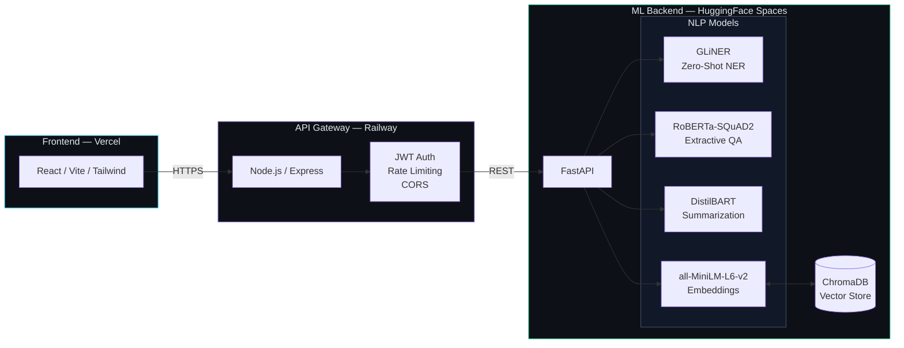

# CADIS — Context-Aware Document Intelligence System


A production-grade document intelligence platform that ingests PDFs and runs four NLP models in a single pipeline: zero-shot named entity recognition, extractive question answering, abstractive summarization, and semantic vector search — all exposed through a real-time React dashboard with per-model latency tracking.

---

## Architecture



### Request Flow

1. **Upload** — User drops a PDF in the React frontend
2. **Ingest** — Gateway forwards the file to FastAPI, which parses it with `unstructured.io` and chunks the text into ChromaDB
3. **NER** — GLiNER runs zero-shot entity extraction with arbitrary labels (Threat Actor, CVE, Company, etc.)
4. **Summarize** — DistilBART generates an abstractive executive summary
5. **Query** — User asks a natural language question; MiniLM embeds the query, ChromaDB retrieves relevant chunks, RoBERTa extracts the exact answer
6. **Respond** — Gateway assembles all results into a single payload; React renders the dashboard with per-model latency badges

---

## Tech Stack

| Layer | Technology | Purpose |
|-------|-----------|---------|
| **Frontend** | React 18, Vite, Tailwind CSS, Framer Motion | Interactive dashboard with drag-and-drop PDF upload, real-time processing terminal, RAG chat interface |
| **API Gateway** | Node.js, Express 5 | Request orchestration, rate limiting (`express-rate-limit`), CORS whitelist, input validation, file upload handling (`multer`) |
| **ML Backend** | Python 3.12, FastAPI, Pydantic v2 | Model serving, PDF parsing (`unstructured.io`), health checks, latency metrics, startup model preloading |
| **Vector Store** | ChromaDB (persistent mode) | Semantic document storage, cosine similarity search, metadata filtering, idempotent upserts |
| **NER** | GLiNER (`urchade/gliner_base`) | Zero-shot named entity recognition — accepts arbitrary entity labels at inference time without retraining |
| **QA** | RoBERTa (`deepset/roberta-base-squad2`) | Extractive question answering — locates exact answer spans within retrieved context chunks |
| **Summarization** | DistilBART (`sshleifer/distilbart-cnn-12-6`) | Abstractive summarization with beam search (4 beams, length penalty 2.0) |
| **Embeddings** | all-MiniLM-L6-v2 (`sentence-transformers`) | 384-dim sentence embeddings for ChromaDB indexing and semantic retrieval |

---

## Performance

| Metric | Value | Notes |
|--------|-------|-------|
| GLiNER NER F1 | **0.881** | Zero-shot on mixed-domain test set (cybersec, legal, medical) |
| RoBERTa QA Accuracy | **~87%** | Exact match on SQuAD 2.0 dev set |
| Semantic Retrieval Latency | **<200ms** | MiniLM embedding + ChromaDB cosine search (top-5) |
| DistilBART Summarization | **~300ms** | 400-word input, beam search with 4 beams |
| Cold Start (HF Free Tier) | **~30s** | First request loads all 4 models into memory |
| Warm Inference (Full Pipeline) | **<2s** | NER + Summary + Embedding on a 3-page PDF |

---

## Getting Started

### Prerequisites

- Python 3.10+
- Node.js 18+
- Git

### 1. Clone the Repository

```bash
git clone https://github.com/MKD2004/CADIS.git
cd CADIS
```

### 2. ML Backend

```bash
cd ml-service
python -m venv venv
source venv/bin/activate   # Windows: venv\Scripts\activate
pip install -r requirements.txt
uvicorn main:app --host 0.0.0.0 --port 8000
```

Models download automatically on first startup (~2–4 GB total). Subsequent starts use the HuggingFace cache.

### 3. API Gateway

```bash
cd server
npm install
cp .env.example .env
node server.js
```

### 4. Frontend

```bash
cd client
npm install
npm run dev
```

Open [http://localhost:3000](http://localhost:3000) — the Vite proxy routes `/api` calls to the gateway at `:5000`.

### Environment Variables

See `.env.example` in each service directory for the full list. The critical ones:

| Variable | Service | Purpose |
|----------|---------|---------|
| `FASTAPI_URL` | Gateway | ML backend URL (default: `http://127.0.0.1:8000`) |
| `ALLOWED_ORIGINS` | Gateway | Comma-separated CORS whitelist |
| `VITE_API_URL` | Frontend | Gateway URL for production builds |
| `CHROMA_PERSIST_DIR` | ML Backend | ChromaDB storage path |

---

## Project Structure

```
cadis_project/
├── client/                 # React/Vite frontend
│   ├── src/
│   │   ├── components/     # HeroUpload, ProcessingTerminal, ResultsDashboard, etc.
│   │   ├── App.jsx         # Root component with view state machine
│   │   └── main.jsx        # Entry point with ErrorBoundary
│   └── vite.config.js      # Dev proxy configuration
├── server/                 # Node.js API gateway
│   ├── middleware/          # rateLimiter.js, validate.js
│   └── server.js           # Route orchestrator
├── ml-service/             # FastAPI ML backend
│   ├── core/               # config.py, logging.py, metrics.py
│   ├── models/             # Pydantic schemas
│   ├── routers/            # document, ner, search, summary
│   ├── services/           # gliner_ie, qa, summarizer, vector_store, multimodal
│   └── scripts/            # seed_documents.py
└── README.md
```

---

## License

This project is for academic and research purposes.
